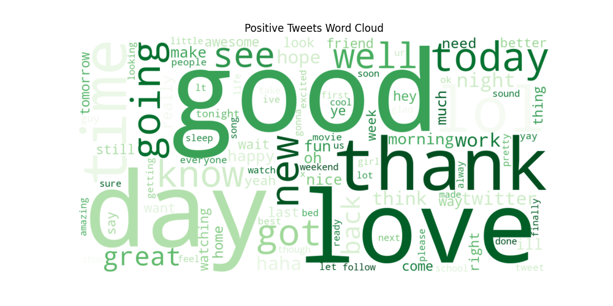
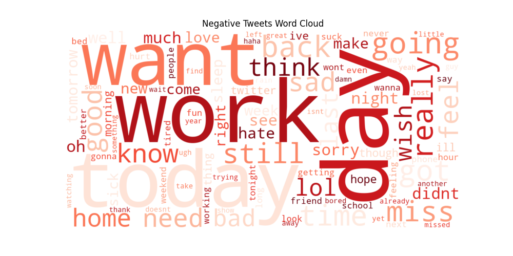

# 🚀 Twitter Sentiment Analysis using NLP

## 📌 Project Overview

This project analyzes Twitter data to understand public sentiment using **Natural Language Processing (NLP)** and **Machine Learning** techniques.

It includes data preprocessing, visualization, model building, and API deployment for real-time sentiment prediction.

---

## 🛠 Tools & Technologies

* Python
* Pandas
* NLTK
* Matplotlib
* Seaborn
* WordCloud
* Scikit-learn
* FastAPI

---

## 📂 Dataset

Dataset used: **Sentiment140 Twitter Dataset**

🔗 https://www.kaggle.com/datasets/kazanova/sentiment140

* Contains **1.6 million tweets labeled with sentiment**

**Sentiment labels:**

* **0 → Negative**
* **4 → Positive**

⚠️ **Note:**
The dataset is **not included** in this repository due to GitHub file size limits.
Download it from Kaggle and place it inside a `dataset/` folder.

---

## ⚙️ Project Workflow

### 1️⃣ Data Loading

* Load dataset using Pandas
* Select relevant columns

### 2️⃣ Data Cleaning

* Remove URLs
* Remove mentions (@username)
* Remove hashtags
* Remove punctuation
* Convert text to lowercase

### 3️⃣ Stopword Removal

* Remove common words (the, is, and, to)
* Add custom stopwords (im, dont, cant, etc.)

### 4️⃣ Text Processing

* Create cleaned tweet text
* Remove empty tweets

### 5️⃣ Data Visualization

* Word Cloud
* Sentiment distribution
* Top 20 most common words
* Tweet length distribution
* Positive vs Negative word clouds

---

## 📊 Visualizations

### 🔹 Word Cloud


### 🔹 Sentiment Distribution


### 🔹 Top 20 Most Common Words


### 🔹 Tweet Length Distribution


### 🔹 Positive Tweets Word Cloud



### 🔹 Negative Tweets Word Cloud



---

## 🤖 Machine Learning Model

* Model Used: **Logistic Regression**
* Feature Extraction: **TF-IDF Vectorization**
* Dataset Size: 100,000 tweets
* Accuracy: ~80%

### 🔍 Model Capabilities

* Converts text into numerical features using TF-IDF
* Classifies tweets into Positive or Negative sentiment
* Supports real-time predictions

---

## 🌐 API Deployment (FastAPI)

The trained model is deployed using **FastAPI**, allowing real-time sentiment prediction.

### 🔹 Features

* Accepts user input (tweet text)
* Returns predicted sentiment
* Interactive API testing using Swagger UI

### ▶️ Run API

```bash
uvicorn code.app:app --reload
```

Then open in browser:

```
http://127.0.0.1:8000/docs
```

---

## 📈 Key Insights

* The dataset shows a **balanced distribution** of positive and negative tweets (~50% each)

* Frequently used words include:

  * *love, good, happy* → positive sentiment
  * *bad, sad, hate* → negative sentiment

* Most tweets are **short (under 15 words)**

* Positive tweets express **happiness and excitement**

* Negative tweets express **frustration and complaints**

* Data preprocessing significantly improves analysis quality

---

## 📁 Project Structure

```
twitter-sentiment-analysis
twitter-sentiment-analysis
│
├── code/
│   ├── code.py                # Main NLP + ML pipeline
│   ├── app.py                 # FastAPI app
│   ├── sentiment_model.pkl    # Trained ML model
│   └── vectorizer.pkl         # TF-IDF vectorizer
│
├── dataset/                   # (NOT uploaded to GitHub)
│   └── training.csv
│
├── visuals/                   # All generated charts
│   ├── wordcloud.png
│   ├── sentiment_chart.png
│   ├── top_words.png
│   ├── tweet_length.png
│   ├── positive_wordcloud.png
│   └── negative_wordcloud.png
│
├── requirements.txt           # Dependencies
├── README.md                  # Project documentation
├── .gitignore                 # Ignore unnecessary files
└── LICENSE (optional)

```

---

## 🚀 How to Run the Project

### 1. Install dependencies

```
pip install -r requirements.txt
```

### 2. Run analysis script

```
python code/code.py
```

### 3. Run API (optional)

```
uvicorn code.app:app --reload
```

---

## 👩‍💻 Author

**Puja Kurde**
🎓 Data Science Student

🔗 GitHub: https://github.com/Pujakurde
