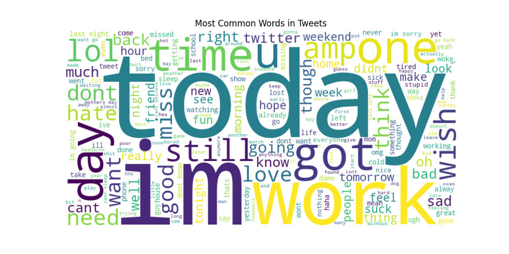
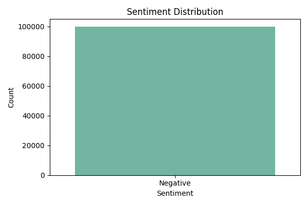
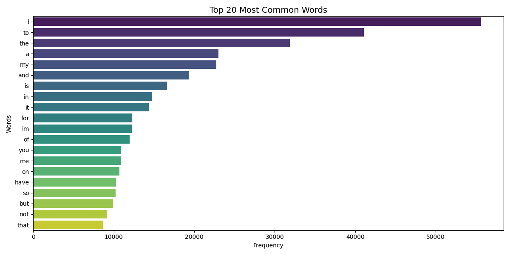
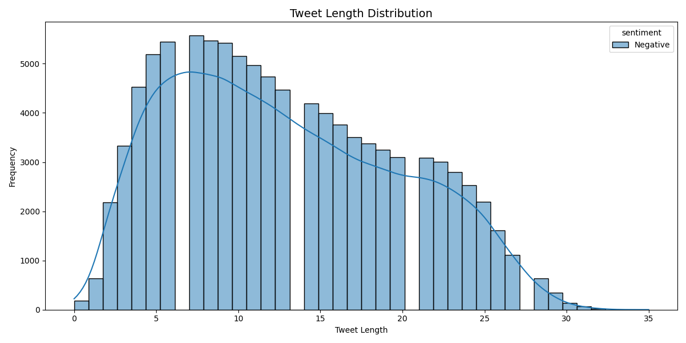

# 🚀 Twitter Sentiment Analysis using NLP

## 📌 Project Overview

This project analyzes Twitter data to understand public sentiment using **Natural Language Processing (NLP)** techniques.

The analysis explores patterns in tweets and visualizes sentiment trends using Python.

---

## 🛠 Tools & Technologies

* Python
* Pandas
* NLTK
* Matplotlib
* Seaborn
* WordCloud

---

## 📂 Dataset

Dataset used: **Sentiment140 Twitter Dataset**

🔗 https://www.kaggle.com/datasets/kazanova/sentiment140

* Contains **1.6 million tweets labeled with sentiment**

**Sentiment labels:**

* **0 → Negative**
* **4 → Positive**

⚠️ **Note:**
The dataset is **not included** in this repository due to GitHub file size limits.
Download it from Kaggle and place it inside a `dataset/` folder.

---

## ⚙️ Project Workflow

### 1️⃣ Data Loading

* Load dataset using Pandas
* Select relevant columns

### 2️⃣ Data Cleaning

* Remove URLs
* Remove mentions (@username)
* Remove hashtags
* Remove punctuation
* Convert text to lowercase

### 3️⃣ Stopword Removal

* Remove common words (the, is, and, to)
* Add custom stopwords (im, dont, cant, etc.)

### 4️⃣ Text Processing

* Create cleaned tweet text
* Remove empty tweets

### 5️⃣ Data Visualization

* Word Cloud
* Sentiment distribution
* Top 20 most common words
* Tweet length distribution
* Positive vs Negative word clouds

---

## 📊 Visualizations

### Word Cloud



### Sentiment Distribution



### Top 20 Most Common Words



### Tweet Length Distribution



---

## 📈 Key Insights

* The dataset shows a **balanced distribution** of positive and negative tweets (~50% each)

* Frequently used words include:

  * *love, good, happy* → positive sentiment
  * *bad, sad, hate* → negative sentiment

* Most tweets are **short (under 15 words)**

* Positive tweets express **happiness, excitement, and appreciation**

* Negative tweets express **frustration, dissatisfaction, and complaints**

* Text preprocessing significantly improves analysis by removing noise

---

## 📁 Project Structure

```
twitter-sentiment-analysis
│
├── code
│   └── code.py
│
├── visuals
│   ├── wordcloud.png
│   ├── sentiment_chart.png
│   ├── top_words.png
│   └── tweet_length.png
│
├── dataset (not included)
├── requirements.txt
├── README.md
└── .gitignore
```

---

## 🚀 How to Run the Project

### Install dependencies

```
pip install -r requirements.txt
```

### Run the project

```
python code/code.py
```

---

## 👩‍💻 Author

**Puja Kurde**
🎓 Data Science Student

🔗 GitHub: https://github.com/Pujakurde
